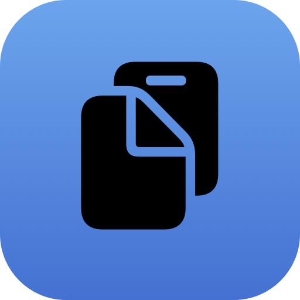

<h1 align="center">
  
  <br>
  copippe
  <br>
  <br>
</h1>

<p align="center">
  A simple, lightweight clipboard tool for macOS that lives in your menu bar.
</p>

<p align="center">
  <a href="https://github.com/yoshidashingo/copippe/releases/latest"></a>
  <a href="https://github.com/yoshidashingo/copippe/blob/main/LICENSE"></a>
  
  
</p>

<p align="center">
  <a href="README.md">English</a> •
  <a href="README-ja.md">日本語</a>
</p>

## Features

- **Plain Text Paste** — When activated, automatically strips rich text formatting (HTML, RTF) on copy, so you always paste clean, plain text
- **Clipboard History** — Access up to 20 recent clipboard entries from the menu bar dropdown
- **Menu Bar Resident** — Runs quietly in the menu bar with no Dock icon
- **Persistent History** — Clipboard history is saved and restored across app restarts
- **Auto Launch** — Optionally starts at login via macOS Login Items
- **Minimal Footprint** — Built with Swift and SwiftUI for low memory usage

## Requirements

- macOS 14 (Sonoma) or later

## Installation

1. Download the latest version from the **[Releases page](https://github.com/yoshidashingo/copippe/releases/latest)**:
   - [`copippe-v0.1.zip`](https://github.com/yoshidashingo/copippe/releases/latest/download/copippe-v0.1.zip) — Zip archive
   - [`copippe-v0.1.dmg`](https://github.com/yoshidashingo/copippe/releases/latest/download/copippe-v0.1.dmg) — Disk image
2. Open the `.zip` or `.dmg` and move `copippe.app` to your Applications folder
3. Launch copippe

> **Note**: Since the app is not notarized, you may need to right-click → Open on first launch.

## Usage

1. Launch copippe — a clipboard icon appears in the menu bar
2. Click the icon to open the dropdown menu
3. **Activate/Deactivate** — Toggle plain text mode on or off
4. **History** — Click any history entry to copy it back to your clipboard, then paste with ⌘V
5. **Clear History** — Remove all saved entries
6. **Quit** — Exit the app

### Menu Bar Icon

| State | Icon |
|-------|------|
| Active | Filled clipboard icon |
| Inactive | Outline clipboard icon |

## Building from Source

```bash
git clone https://github.com/yoshidashingo/copippe.git
cd copippe
xcodebuild -project copippe.xcodeproj -scheme copippe -configuration Release build
```

Or open `copippe.xcodeproj` in Xcode and build with ⌘B.

## License

MIT
