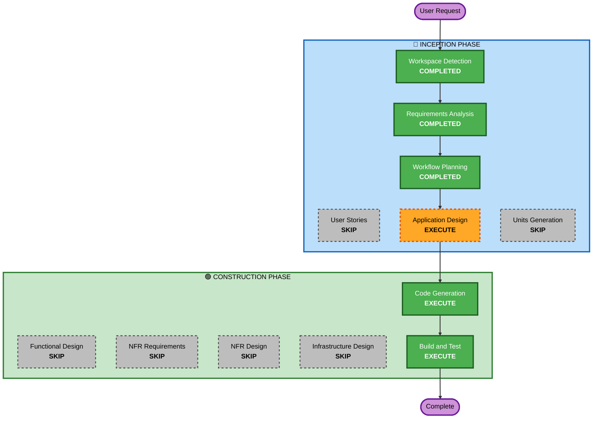

# Execution Plan

## Detailed Analysis Summary

### Change Impact Assessment
- **User-facing changes**: Yes - 新規アプリケーション全体
- **Structural changes**: Yes - ゼロからの構築
- **Data model changes**: Yes - コピー履歴の永続化モデル
- **API changes**: No - 外部API連携なし
- **NFR impact**: Yes - メモリフットプリント最小化

### Risk Assessment
- **Risk Level**: Low
- **Rollback Complexity**: Easy（新規プロジェクト）
- **Testing Complexity**: Moderate（クリップボード操作のテスト）

## Workflow Visualization

## Phases to Execute

### 🔵 INCEPTION PHASE
- [x] Workspace Detection (COMPLETED)
- [x] Requirements Analysis (COMPLETED)
- [ ] User Stories - SKIP
  - **Rationale**: 単一ユーザー向けのシンプルなユーティリティ。ペルソナやユーザーストーリーは不要
- [x] Workflow Planning (COMPLETED)
- [ ] Application Design - EXECUTE
  - **Rationale**: クリップボード監視、履歴管理、メニューUI、永続化の各コンポーネント設計が必要
- [ ] Units Generation - SKIP
  - **Rationale**: 小規模アプリのため単一ユニットで十分

### 🟢 CONSTRUCTION PHASE
- [ ] Functional Design - SKIP
  - **Rationale**: Application Designでビジネスロジックを十分にカバー
- [ ] NFR Requirements - SKIP
  - **Rationale**: 要件定義書でNFR（メモリ効率、App Sandbox）は明確
- [ ] NFR Design - SKIP
  - **Rationale**: メモリ効率はSwiftUIの標準的な設計で達成可能
- [ ] Infrastructure Design - SKIP
  - **Rationale**: ローカルデスクトップアプリ。インフラ設計不要
- [ ] Code Generation - EXECUTE
  - **Rationale**: アプリケーションコードの生成が必要
- [ ] Build and Test - EXECUTE
  - **Rationale**: ビルド確認とテストの実行が必要

### 🟡 OPERATIONS PHASE
- [ ] Operations - PLACEHOLDER

## Success Criteria
- **Primary Goal**: メニューバー常駐のプレーンテキストコピペツールの完成
- **Key Deliverables**: Xcodeプロジェクト、SwiftUIアプリケーションコード、テスト
- **Quality Gates**: ビルド成功、基本機能動作確認
